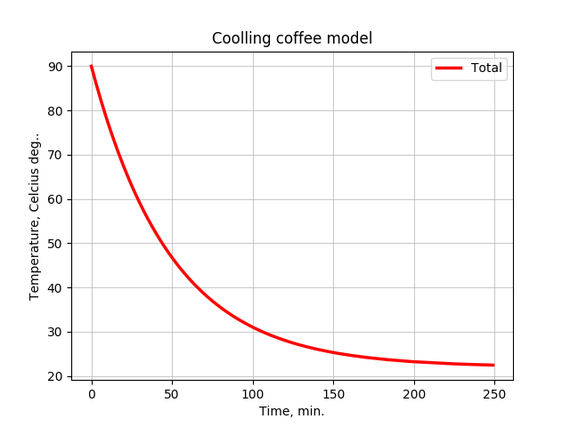
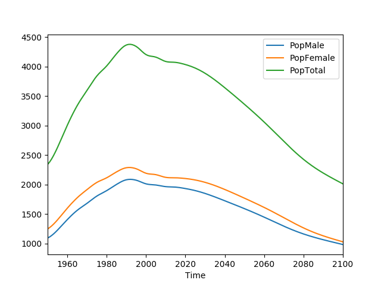

# Python for real tasks

1. The coffee cooling task

    The coffee cooling problem was discussed by Jearl Walker
    in Scientific Amerian in 1977. Is become a standard example of modeling and
    simulation. He is short app of simulation in Python of a cooling cup of coffee.

        More: https://github.com/AllenDowney/ModSimPy
              http://greenteapress.com/ModSimPy/ModSimPy.pdf

2. Pandas/Python Data Analysis of UN site of population data:
           reference: csv refference: https://population.un.org/wpp/Download/Standard/CSV/
   Following operations:
      * Pandas DataFrame by reading csv file
      * select DataFrame profile
      * Show DataFrame selected data with Matplotlib graph
      * save plot image to *.png file

3. TableFrame : Table data frame
    
4. UN_population - Python for Data Atalysis

5. Create Pythob script googlesearch

    Run the script by using its filename
            $ ./g_search.py 
